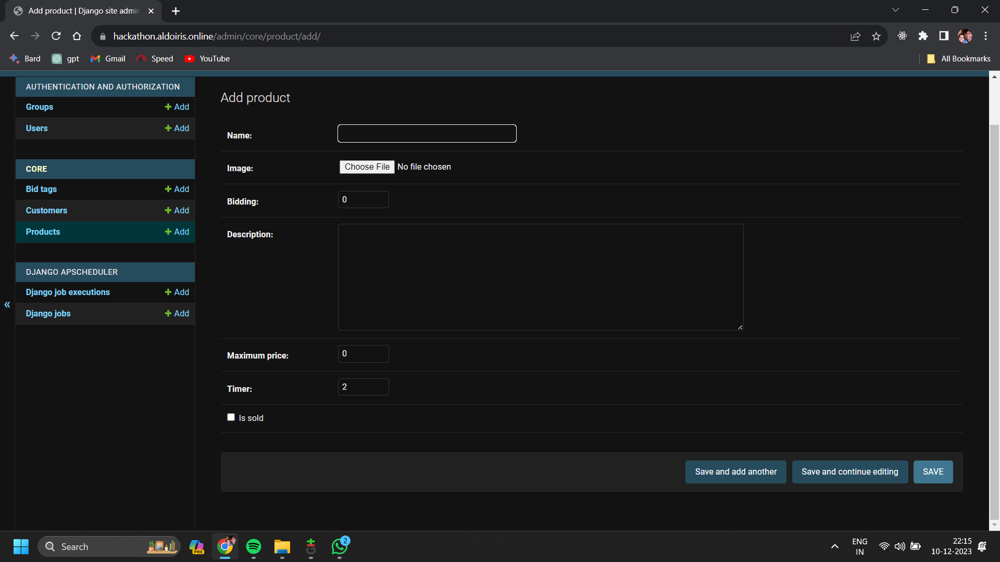
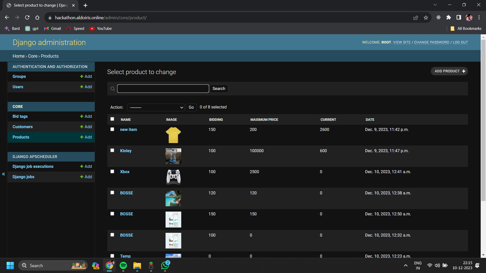

# Bidding Fullstack App - Sahyadri College Hackathon Winner

## Description
This fullstack app, developed during the Sahyadri College of Engineering hackathon, facilitates bidding on various products. The app allows sellers to upload product details while enabling buyers to place bids within a specified deadline. Built for Android using Flutter for the frontend and Django for the backend, it emerged as the winner securing the first prize.

## Features
- **Seller Dashboard:** Upload product details and descriptions.
- **Buyer Bidding:** Place bids on products within a set timeframe.
- **Deadline Management:** Bidding closes after the set deadline.
- **Winning Offers:** Upon closure, the highest bid secures the product.

## Folder Structure
- **frontend:** Contains Flutter code for the Android app's frontend UI.
- **backend:** Django backend code responsible for managing the bidding system.

## Technologies Used
- **Frontend:** Flutter
- **Backend:** Django Rest Framework

## Usage
1. Clone the repository.
2. Navigate to the respective frontend and backend folders.
3. Follow setup instructions within the folders to run each part of the app.

## Hackathon Details
- **Event:** Sahyadri College of Engineering Hackathon
- **Date:** 10/12/2023
- **Award:** First Prize

## Contributors
- [Swathi](https://github.com/SwathiSherigar)
- [Adarsh Savalagi](https://github.com/AdarshSavalagi)
- [Abishai](https://github.com/abishaikanhiram)
- [Saji P J]()
## Screenshots (if available)
***Frontend Mobile UI***

***Admin panel***

## License
This project is licensed under [MIT License](LICENSE).
